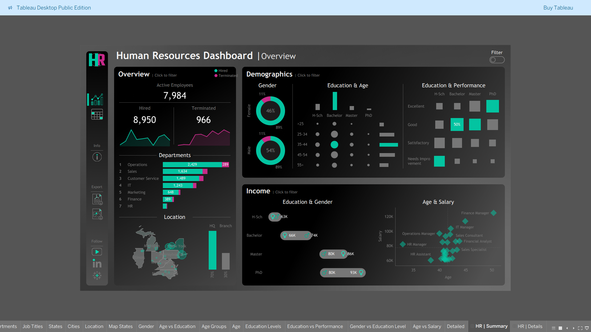

---

## 📊 Live HR Dashboard

🔗 **View the Interactive Tableau Dashboard:**  
👉 [HR Summary Dashboard on Tableau Public](https://public.tableau.com/views/HRDashboard_17607540673410/HRSummary?:language=en-US&:sid=&:redirect=auth&:display_count=n&:origin=viz_share_link)](https://public.tableau.com/views/HRDashboard_17607540673410/HRSummary?:language=en-US&:sid=&:redirect=auth&:display_count=n&:origin=viz_share_link)

 

*The dashboard is fully interactive — explore employee metrics, attrition trends, and departmental insights in real time.*

---

## 🧠 Key Insights

📉 Identified departments with the highest attrition rates  
👩‍💼 Gender ratio analysis across departments  
💰 Salary distribution visualization by role and performance  
📅 Age and experience distribution for strategic HR planning  
🔁 Employee turnover trends by job satisfaction level  

---

## ⚙️ Installation & Usage

If you'd like to explore or recreate the analysis locally:

# Clone the repository
git clone https://github.com/<your-username>/hr-dashboard-visualization.git
cd hr-dashboard-visualization

# Install dependencies
pip install -r requirements.txt
